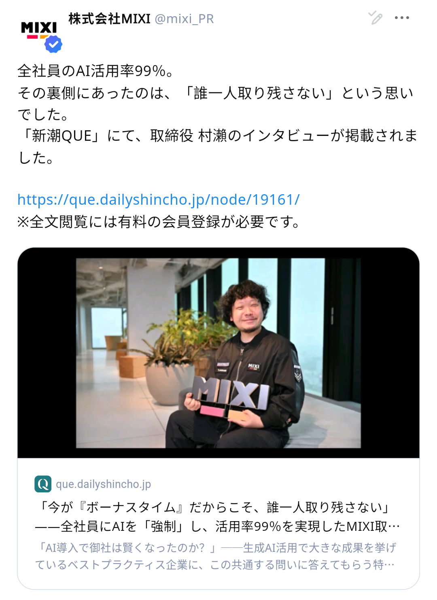
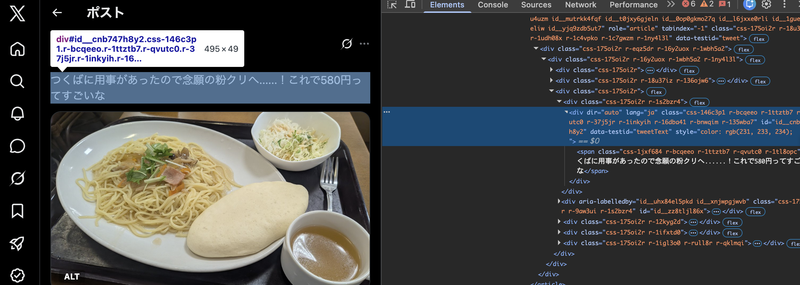
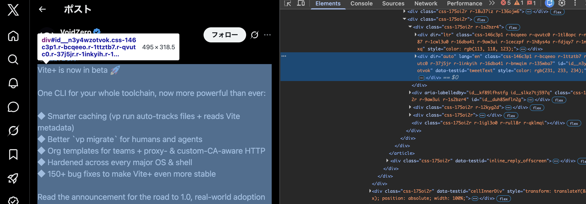

# 言語設定を英語にしたら<br>日本語が中国語になった

<div class="pt-12 opacity-80">
  2026年7月6日 ・ CA Tech Lounge LT会
</div>

---
layout: default
---

<div style="display: flex; justify-content: space-between; align-items: flex-start;">

<div class="pt-4">

## newt <span style="font-size: 0.6em;">(@newt239)</span>

- 芝浦⼯業⼤学 デザイン⼯学部 3年
- Webフロントエンドエンジニア
- デザインシステム / Web標準 / Webアクセシビリティ
- デザイン / タイポグラフィ

</div>


</div>

<div style="display: flex; justify-content: center; gap: 1.5rem; margin-top: 1rem;">
<v-click>

</v-click>
<v-click>

</v-click>
</div>
---
layout: default
---

## 端末の言語設定を英語にして mixi2を開いた

<v-click>

</v-click>

---
layout: default
---

## CJK 統合漢字

日中韓で微妙に字形が違う漢字を、Unicode は同じコードポイントに統合している

<div class="grid grid-cols-2 gap-4 pt-6 text-center">
  <div class="border rounded p-4">
    <div class="text-sm opacity-60">lang="ja"（日本語）</div>
    <div lang="ja" class="text-6xl pt-2">骨直次令</div>
  </div>
  <div class="border rounded p-4">
    <div class="text-sm opacity-60">lang="zh-CN"（簡体字）</div>
    <div lang="zh-CN" class="text-6xl pt-2">骨直次令</div>
  </div>
  <div class="border rounded p-4">
    <div class="text-sm opacity-60">lang="zh-TW"（繁体字）</div>
    <div lang="zh-TW" class="text-6xl pt-2">骨直次令</div>
  </div>
  <div class="border rounded p-4">
    <div class="text-sm opacity-60">lang="ko"（韓国語）</div>
    <div lang="ko" class="text-6xl pt-2">骨直次令</div>
  </div>
</div>

<div class="pt-6 text-center opacity-80">
コードポイントが U+9AA8 U+76F4 U+6B21 U+4EE4 の文字を並べた様子
</div>

---
layout: default
---

## mixi2のネイティブアプリにおける挙動

<div class="pt-4">

- mixi2 は Flutter 製
- Flutter のテキストエンジンは字形解決に locale を参照する
- `TextStyle.locale` で `ja` を明示していれば日本語字形
  - 多言語対応をする際、アプリ全体にこれを設定することはできない
- 明示していなければ端末のシステム言語に追従

</div>

---
layout: default
---

## OSによるフォールバック方法の違い

iOSは「優先する言語の順序」の順にフォールバックしていくため、英語の次に日本語を設定していれば問題は発生しない。

一方でAndroidはlocaleの解決時最上位に設定されている言語しか見ないため、言語がCJK以外に設定されているときは簡体字中国語が優先される。

---
layout: default
---

## Twitter はツイートごとに言語を自動判定

<div class="pt-4">

```html
<div lang="ja" dir="auto">1個目のツイート</div>
<div lang="en" dir="auto">second tweet</div>
```



</div>

---
layout: default
---

## Twitter はツイートごとに言語を自動判定

<div class="pt-4">

```html
<div lang="ja" dir="auto">1個目のツイート</div>
<div lang="en" dir="auto">second tweet</div>
```



</div>

---
layout: default
---

## UGCにおける多言語対応のポイント

<div class="pt-4">

- 特にCJKは機械的な言語判定が難しい
- 投稿ごとに言語情報を持っておく

</div>