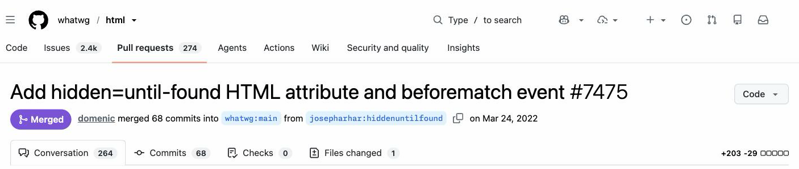
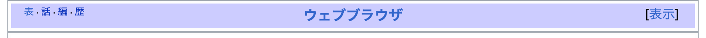
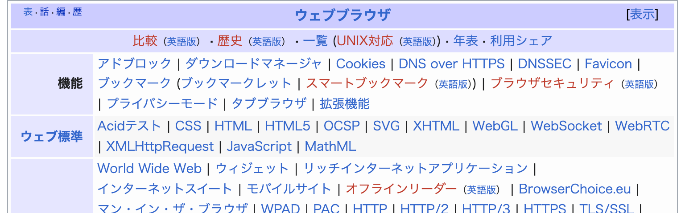
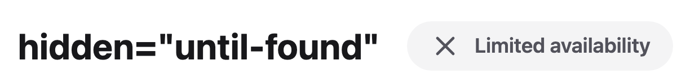

# hidden="until-found"を使って<br>アクセシブルな折りたたみを実装する

---
layout: image-right
---

# newt <span class="muted subtitle-size">@newt239</span>

<ul>
  <li>学生</li>
  <li>興味領域
    <ul>
      <li>デザインシステム</li>
      <li>Webアクセシビリティ</li>
      <li>フロントエンドエコシステム</li>
      <li>Web標準</li>
    </ul>
  </li>
</ul>

::media::


---
layout: default
---

# hidden="until-found"とは

- HTMLのhidden属性がとれる新しい値
- それまで真偽属性だったhiddenが列挙属性に
- 2022年3月にLiving Standardとして取り込まれた



---
layout: default
---

# 従来のhidden="true"との違い

ブラウザのページ内検索やテキストフラグメントでヒットしたときに、hiddenが解除されてスクロールされるようになる

<iframe class="embed" src="https://ja.wikipedia.org/wiki/HTML#W3C標準" title="Wikipedia「HTML」の記事"></iframe>

---
layout: default
---

# Wikipediaの関連項目セクションにおける実装例

<div class="shots">
  <figure>
    
    <figcaption class="caption">折りたたまれている状態</figcaption>
  </figure>
  <figure>
    
    <figcaption class="caption">ページ内検索でヒットして開いた状態</figcaption>
  </figure>
</div>

---
layout: default
---

# details/summaryでも同様の効果が

- アコーディオンではこちらを使用する
- until-foundと同じ2025年12月のSafari 26.2でShip
  - ただし「マッチ箇所へスクロールしない」既知バグ（[WebKit #304174](https://webkit.org/b/304174)）が未修正
  - そのためBaselineは現在Limited available



---
layout: default
---

# 非対応ブラウザで使っても問題ない

hidden="until-found"がhidden="true"へフォールバックされるだけ

```html
<div hidden="until-found">
  検索でヒットさせたい本文
</div>
```

---
layout: default
---

# まとめ

- hidden="until-found"はHTMLのグローバル属性
- 折りたたみUI内のテキストがページ内検索で見つかるようになる
- 未対応環境でもフォールバックされるのですぐに導入可能

---
layout: default
---

# 参考リンク

- MDN: [hidden グローバル属性](https://developer.mozilla.org/ja/docs/Web/HTML/Reference/Global_attributes/hidden)
- Chrome for Developers: [hidden=until-found](https://developer.chrome.com/docs/css-ui/hidden-until-found)
- WHATWG HTML Standard: [The hidden attribute](https://html.spec.whatwg.org/multipage/interaction.html#the-hidden-attribute)
- Web Platform Status: [hidden-until-found](https://webstatus.dev/features/hidden-until-found)
- 実例: [ja.m.wikipedia.org](https://ja.m.wikipedia.org/wiki/HTML)
