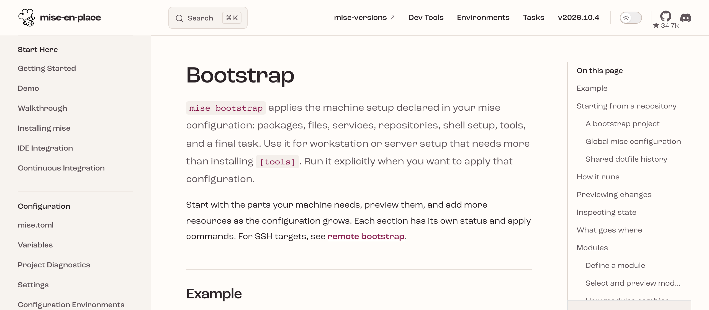

# mise bootstrapで<br>dotfilesを宣言的に


---
layout: image-right
---

# newt <span class="muted small">@newt239</span>

- 芝浦⼯業⼤学 B3
- Webフロントエンドエンジニア
- 興味領域
  - デザインシステム
  - Webアクセシビリティ
  - フロントエンドエコシステム
  - Web標準

::media::


---
layout: figure-bottom
---

# `mise bootstrap`

- mise の設定ファイルにマシンの状態を宣言し、コマンド 1 つで反映
- 対象はパッケージ・dotfiles・macOS の設定・ログインシェル・ツール
- v2026.6.6 で experimental 機能として追加

::media::



---
layout: default
---

# Before: Makefile + シェルスクリプト

- `make` で init → link → defaults → brew の順にスクリプトを実行
- 処理の手順を記述する手続き型。再実行時の挙動はスクリプトごとに異なる

<div class="grid grid-cols-2 gap-[3cqw] items-start code-sm">

```text
dotfiles/
├── Makefile
├── .bin/
│   ├── init.sh
│   ├── link.sh
│   ├── mise.sh
│   ├── brew.sh
│   ├── defaults.sh
│   └── Brewfile
├── editor/
│   └── vscode.sh
└── home/
    └── .mise.toml
```

```make
all: init link defaults brew

init:
	@.bin/init.sh
link:
	@.bin/link.sh
defaults:
	@.bin/defaults.sh
brew:
	@.bin/brew.sh
```

</div>

---
layout: compare
before: .bin/link.sh
after: home/.mise.toml
code: sm
---

# シンボリックリンク

- `symlink-each` で `home/` 以下をファイル単位でリンク
- `home/` 以外に置いたファイルはリンク先ごとにリンク元を指定

::left::

```bash
link() {
  mkdir -p "$(dirname "$2")"
  ln -fns "$REPO/$1" "$2"
}

cd "$REPO/home"
find . -type f ! -name .DS_Store |
  while read -r f; do
    link "home/${f#./}" "$HOME/${f#./}"
  done

link config/gnupg/gpg-agent.conf \
  "$HOME/.gnupg/gpg-agent.conf"
```

::right::

```toml
[dotfiles."~"]
source = "~/dotfiles/home"
mode = "symlink-each"
exclude = [".DS_Store"]

[dotfiles."~/.gnupg/gpg-agent.conf"]
source = "~/dotfiles/config/gnupg/gpg-agent.conf"
```

---
layout: compare
before: .bin/defaults.sh
after: home/.mise.toml
code: xs
wrap: true
---

# macOS の設定

- Dock・Finder・キーボード・トラックパッドは専用のキーで記述
- ネストした plist は `defaults_entries` の `path` で該当する値だけを変更

::left::

```bash
defaults write com.apple.dock autohide -bool true
defaults write com.apple.finder AppleShowAllFiles -bool true
defaults write com.apple.symbolichotkeys.plist AppleSymbolicHotKeys -dict-add 64 "
  <dict>
    <key>enabled</key><false/>
    <key>value</key><dict>
      <key>type</key><string>standard</string>
      <key>parameters</key>
      <array>
        <integer>65535</integer>
        <integer>49</integer>
        <integer>1048576</integer>
      </array>
    </dict>
  </dict>
"
```

::right::

```toml
[bootstrap.macos.dock]
autohide = true

[bootstrap.macos.finder]
show_all_files = true

[[bootstrap.macos.defaults_entries]]
domain = "com.apple.symbolichotkeys"
key = "AppleSymbolicHotKeys"
path = ["64", "enabled"]
value = false
```

---
layout: compare
before: .bin/Brewfile
after: home/.mise.toml / home/.mise.work.toml
code: sm
wrap: true
---

# パッケージ

- `brew:` `brew-cask:` `mas:` のプレフィックスでインストール元を指定
- `mise.<環境名>.toml` に分割し、`-E <環境名>` で読み込むファイルを切り替え

::left::

```ruby
cask "google-chrome"
cask "visual-studio-code"
brew "mise"
cask "docker-desktop"
cask "ghostty"

brew "curl"
brew "direnv"
brew "gh"
brew "postgresql@17", restart_service: true, link: true
brew "mas"
```

::right::

```toml
[bootstrap.packages]
"brew:curl" = "latest"
"brew:direnv" = "latest"
"brew:gh" = "latest"
"brew:postgresql@17" = "latest"
"brew:mas" = "latest"

"brew-cask:google-chrome" = "latest"
"brew-cask:visual-studio-code" = "latest"
"brew-cask:docker-desktop" = "latest"
"brew-cask:ghostty" = "latest"
"mas:1429033973" = "latest"
```

---
layout: compare
before: .bin/init.sh / .bin/mise.sh
after: home/.mise.toml
wrap: true
---

# ログインシェルとツール

- ログインシェルも宣言の対象
- `[tools]` のインストールは bootstrap の手順の 1 つとして実行

::left::

```zsh
if [ "$SHELL" != "/bin/zsh" ]; then
	chsh -s /bin/zsh
fi
```

```bash
source ~/.zshrc
if [ ! -f "$HOME/.mise.toml" ]; then
  echo ".mise.tomlファイルが見つかりません。"
  exit 1
fi
mise install
```

::right::

```toml
[bootstrap.user]
login_shell = "/bin/zsh"

[tools]
go = "1.26.1"
python = "3.14.3"
rust = "1.94.0"
node = "24.21.0"
```

---
layout: default
---

# `mise bootstrap status`

- 宣言した項目ごとに現在の状態を一覧表示
- `differs` は宣言と実際の状態が一致していない項目

<div class="code-sm">

```text
$ mise bootstrap status -C home -E work
dotfiles  ~                       symlink-each ~/dotfiles/home   differs
dotfiles  ~/.gnupg/gpg-agent.conf symlink ~/dotfiles/config/gnupg/gpg-agent.conf   applied
defaults  com.apple.dock autohide                    true      set
defaults  com.apple.dock persistent-apps             array (7 items)   differs
defaults  NSGlobalDomain InitialKeyRepeat            10        set
defaults  NSGlobalDomain com.apple.keyboard.fnState  false     differs
user      login_shell                                /bin/zsh  set
tools     node@24.21.0                               24.21.0   installed
packages  brew:gh                                    2.100.0   installed
packages  brew-cask:ghostty                          1.3.1     installed (auto-updates)
```

</div>

---
layout: default
---

# CI

- `mise bootstrap plan` で適用内容を事前に確認
- `--only dotfiles` で適用する対象を限定
- `dotfiles status --missing` で未適用のリンクを確認

<div class="code-sm">

```yaml
- name: Validate config
  run: |
    mise trust ~/dotfiles/home/.mise.toml
    mise bootstrap plan -C ~/dotfiles/home
    mise bootstrap dotfiles status -C ~/dotfiles/home -E work
- name: Apply dotfiles
  run: mise bootstrap -C ~/dotfiles/home --yes --only dotfiles --force-dotfiles
- name: Check convergence
  run: mise bootstrap dotfiles status -C ~/dotfiles/home --missing
```

</div>

---
layout: default
---

# 参考

- [Bootstrap | mise-en-place](https://mise.jdx.dev/bootstrap.html)
- [続・dotfiles管理、miseに全部任せてみた 〜mise の最新 bootstrap 機能を追う〜](https://zenn.dev/boykush/articles/8d3f52c1a97b04)
- [newt239/dotfiles](https://github.com/newt239/dotfiles)
