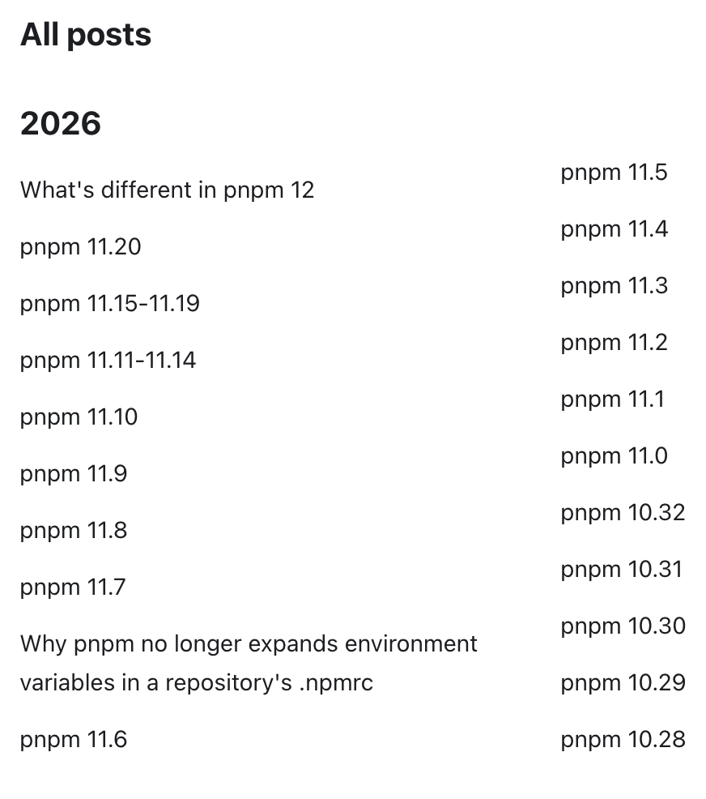
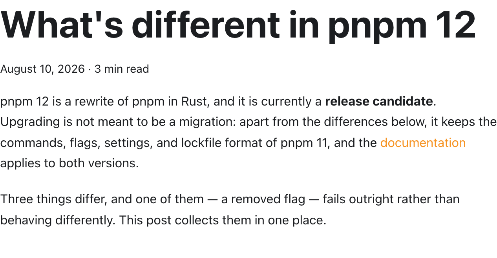
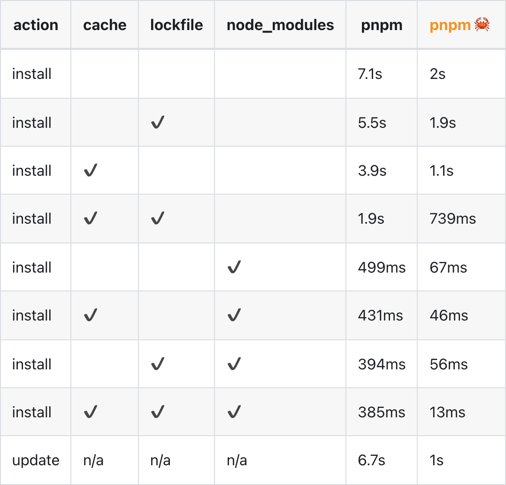

# pnpmのリリース頻度が<br>速すぎる話

---
layout: image-right
---

# newt <span class="muted subtitle-size">@newt239</span>

<ul>
  <li>芝浦⼯業⼤学 B3</li>
  <li>Webフロントエンドエンジニア</li>
  <li>興味領域
    <ul>
      <li>デザインシステム</li>
      <li>Webアクセシビリティ</li>
      <li>フロントエンドエコシステム</li>
      <li>Web標準</li>
    </ul>
  </li>
</ul>

::media::


---
layout: default
---

# ランタイムとパッケージマネージャ

- ランタイム
  - Node.js / Deno / Bun
- パッケージマネージャ
  - npm / Yarn / pnpm
  - いずれもNode.js上で動作
- Bunはランタイムであり、パッケージマネージャでもある

---
layout: default
---

# レジストリの選択肢

- [npm registry]{.tag} 事実上の標準
- [JSR]{.tag} TypeScriptファーストでESModule専用。npm互換層経由でpnpmからも利用可能
- [vlt]{.tag} npmレジストリAPI互換のホスト型。2026年8月にv1.0
- [pnpr]{.tag} pnpm公式のRust製レジストリサーバ。現時点では実験的

---
layout: figure-right
---

# 2026年のリリース状況

- 4月末のv11.0以降、約4.9日に1本のペース
- v11.0からv11.20までの21本を97日間でリリース
- 8月10日にv12がリリース候補として公開

::media::



---
layout: default
---

# 追加されたコマンド

- [v11.1]{.tag} `pnpm audit signatures` / `pnpm bugs` / `pnpm owner`
- [v11.3]{.tag} `pnpm stage`（段階的な公開）
- [v11.10]{.tag} `pnpm prefix` / `pnpm issues`
- [v11.11]{.tag} `pnpm change` / `pnpm doctor` / `pnpm access` / `pnpm team`
  - `pnpm change` はchangesetsの代替となりうる機能で、ワークスペースのリリース管理が可能
  - `pnpm doctor` はインストール環境の診断コマンド

---
layout: default
---

# サプライチェーン対策の強化

- [v11.4]{.tag} tarballの完全性の不一致を既定でハードエラーに
  - tarballは配布されるパッケージ本体。従来は不一致でも警告のみで継続
- [v11.15]{.tag} `pnpm self-update` がプロジェクト設定を参照しないよう変更
  - リポジトリ側の設定でpnpm自体の取得元や認証情報を差し替える経路を封鎖
- [v11.20]{.tag} named registryをレジストリ修飾キーでlockfileに記録
  - 別レジストリの同名同バージョンが同一エントリに潰れる問題を修正

---
layout: default
---

# ランタイム管理の内蔵

- グローバルの `node` / `deno` / `bun` の実体をpnpmが差し替え
- 実行時にプロジェクトを遡り `devEngines.runtime` の指定を解決
- プロジェクト外ではグローバル版。nvmなどのバージョンマネージャーが不要に

```json
{
  "devEngines": {
    "runtime": { "name": "node", "version": "^24.4.0" }
  }
}
```

---
layout: default
---

# pnpm 12: Rustによる全面書き直し

- コマンド・フラグ・設定・lockfile形式はv11のまま
- リリース候補として `pnpm@next-12` で導入可能



---
layout: figure-right
---

# 公称ベンチマーク

- 全てキャッシュ済みのinstallは385ms → 13msで約30倍
- 何もキャッシュされていない状態では7.1s → 2sで約3.6倍
- `pnpm update` は6.7s → 1sで約6.7倍
- [pnpm.io/benchmarks](https://pnpm.io/benchmarks)

::media::



---
layout: default
---

# 参考リンク

- [pnpm Blog]{.tag} [What's different in pnpm 12](https://pnpm.io/blog/whats-different-in-pnpm-12)
- [pnpm Blog]{.tag} [pnpm 11.20](https://pnpm.io/blog/releases/11.20)
- [pnpm Docs]{.tag} [pnpr](https://pnpm.io/pnpr)
- [GitHub Discussions]{.tag} [pnpm v12](https://github.com/orgs/pnpm/discussions/11292)
- [JSR]{.tag} [Introduction](https://jsr.io/docs/introduction)
- [vlt]{.tag} [vlt 1.0 & Hosted Package Registries](https://www.vlt.io/blog/1-0)
